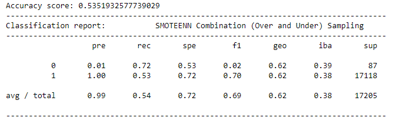

# Overview Of Project:

All over the world, people borrowed money to purchase home or car, start businesses, purse education for examples. That said, loans are an important part of modern society. 
In 2019, more than 19 million Americans had at least one unsecured personal loan.  Personal lending is growing faster than other loan previously state. 
But loans  also presents a challenge for banks and other lending institutions. On one hand, they create revenues with the interest they generate, on another hand they represent a risk as the borrower does not repay it and financial institutions will then lose money. 
Working for LendingClub, a peer-to-peer lending services company, we use fin-tech technology to analyze large amounts of data and predict trends to optimize lending.

# Results:

For this analysis we use and analyse results of six different machine-learning models to find out which one will ensure the best predictions risk to whether lend money or not. 
Some metrics will give use insights on which algorithm perform the best:

- **Accuracy score:** 
  Accuracy is one metric for evaluating classification models. Informally, accuracy is the fraction of predictions our model got right
- **Precision score:** 
  Precision is the ability of a classifier not to label an instance positive that is actually negative. For each class, it is defined as the ratio of true positives to the sum of a true positive and false positive.
- **Recall score:** 
Recall is the ability of a classifier to find all positive instances. For each class it is defined as the ratio of true positives to the sum of true positives and false negatives.

1. *Naive Random Oversampling model:*

For this model, we have an accuracy score of ~0.67, which mean that our model is ~70% accurate with a precision of 0.99, telling us that the low false positive rate is good.The sensitivity (0.66) is good for this model because above 0.5.

2. *SMOTE Oversampling model:*

 
For this model, we have an accuracy of ~66%, with a precision of 0.99 and a recall of 0.66.

3. *ClusterCentroids re-sampler model:*

  
This model showcase an accuracy score of ~50% which is pretty low. Looking at the recall score (0.47) tell us that this model is not excellent at prediction because under 0.5. 

4. *SMOTEENN model:*

 
As the previous model accuracy score (~53%) is pretty low as well as the recall score (0.54) which indicate that the model is not really accurate for prediction even if the precision is good (1.0).
   
5. *RandomForestClassifier model:*

Accuracy score is ~100% which is pretty good as well as the sensitivity (1.0), and the recall score (1.0).   
6. *AdaBoostClassifier model:*

  
Accuracy score is ~100% which is pretty good as well as the sensitivity (1.0), and the recall score (1.0).   

# Summary:

Looking at the results, the model 3 and 4 are not good algorithm for prediction of credit card risk due to their low accuracy and recall score. 
the two first model (1/2) give us good insights but the 5 and 6 are much better with an accuracy score at around 100%.
Our recommendations here is to use either of 5 or 6 model, with a preference for model 6 who is a little more accurate when looking at all score independently.

